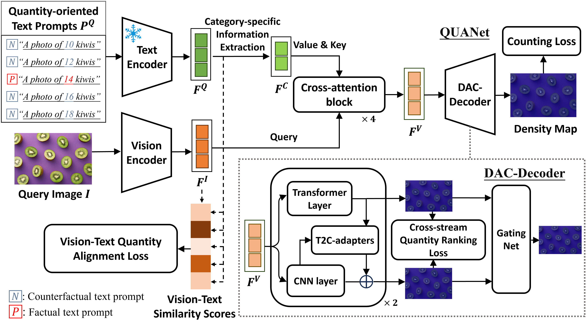

# Text-promptable Object Counting via Quantity Awareness Enhancement (QUANet)

## Overview

This repository contains the official implementation of the paper:  
**Text-promptable Object Counting via Quantity Awareness Enhancement** [arXiv](https://arxiv.org/abs/2507.06679)



## ⚙️ Environment Setup

### 1. Create Conda Environment

```bash
conda create -n quanet python=3.8 -y
conda activate quanet
```

### 2. Install PyTorch (CUDA 11.6)

```bash
pip install torch==1.13.1+cu116 torchvision==0.14.1+cu116 torchaudio==0.13.1 \
    --extra-index-url https://download.pytorch.org/whl/cu116
```

### 3. Install DINOV2

```bash
git clone https://github.com/facebookresearch/dinov2
cd dinov2
pip install -e .
cd ..
```

### 4. Install Remaining Dependencies

```bash
pip install -r requirements.txt
```

---

## 📂 Data Preparation

### FSC-147 Dataset

Download the [FSC-147](https://github.com/cvlab-stonybrook/LearningToCountEverything) dataset and organize it as follows:

```text
QUANet-2/
├── data/
│   └── FSC/
│       ├── FSC_147/
│       │   ├── annotation_FSC147_384.json
│       │   ├── Train_Test_Val_FSC_147.json
│       │   └── ImageClasses_FSC147.txt
│       ├── gt_density_map_adaptive_384_VarV2/
│       └── images_384_VarV2/
├── models/
├── util/
├── run.py
└── requirements.txt
```

## 🔧 Pre-trained Checkpoints

### BERT (bert-base-uncased)

Download `bert-base-uncased` from [Hugging Face](https://huggingface.co/google-bert/bert-base-uncased) and place it at:

```
bert_ckpt/
└── bert-base-uncased/
    ├── config.json
    ├── pytorch_model.bin
    ├── tokenizer_config.json
    └── vocab.txt
```

### DINOv2 (ViT-B/14 with Registers)

Download `dinov2_vitb14_reg4.pth` from the [Meta DINOv2 release](https://github.com/facebookresearch/dinov2) <!-- TODO: verify exact filename --> and place it at:

```
dinov2_ckpt/
└── dinov2_vitb14_reg4.pth
```

The model is loaded **locally** from this path at runtime (no internet access required during training/inference).

---

## 🚀 Training

You can train the model using the following command. Ensure that you have correctly placed the BERT and DINOv2 weights as described in the Pre-trained Checkpoints section before training.

```bash
python run.py --mode train --exp_name exp --batch_size 32
```

> We provide  pre-trained checkpoints for convenience. You can download them here: [OneDrive](https://1drv.ms/u/c/63af628aa5beb906/IQBjjiV3LCOpRICVvetOEJ6BAaCZg5YCz-ZwTsGO-_yH-RA?e=3feLKH)

## 🧪 Inference / Testing

Test the performance of trained ckpt with following command.

```bash
python run.py  --mode test  --ckpt path-to-model
```

---

## 📝 Citation

If you find this work useful, please cite:

```bibtex
@article{shi2025text,
  title={Text-promptable Object Counting via Quantity Awareness Enhancement},
  author={Shi, Miaojing and Zhang, Xiaowen and Yue, Zijie and Luo, Yong and Zhao, Cairong and Li, Li},
  journal={arXiv preprint arXiv:2507.06679},
  year={2025}
}
```

---

## 🙏 Acknowledgements

This implementation builds upon:

- [FSC-147](https://github.com/cvlab-stonybrook/LearningToCountEverything) — dataset and evaluation protocol
- [DINOv2](https://github.com/facebookresearch/dinov2) — visual backbone
- [BERT](https://huggingface.co/google-bert/bert-base-uncased) — text encoder
- [CLIP-Count](https://github.com/songrise/CLIP-Count) — data loader reference implementation
